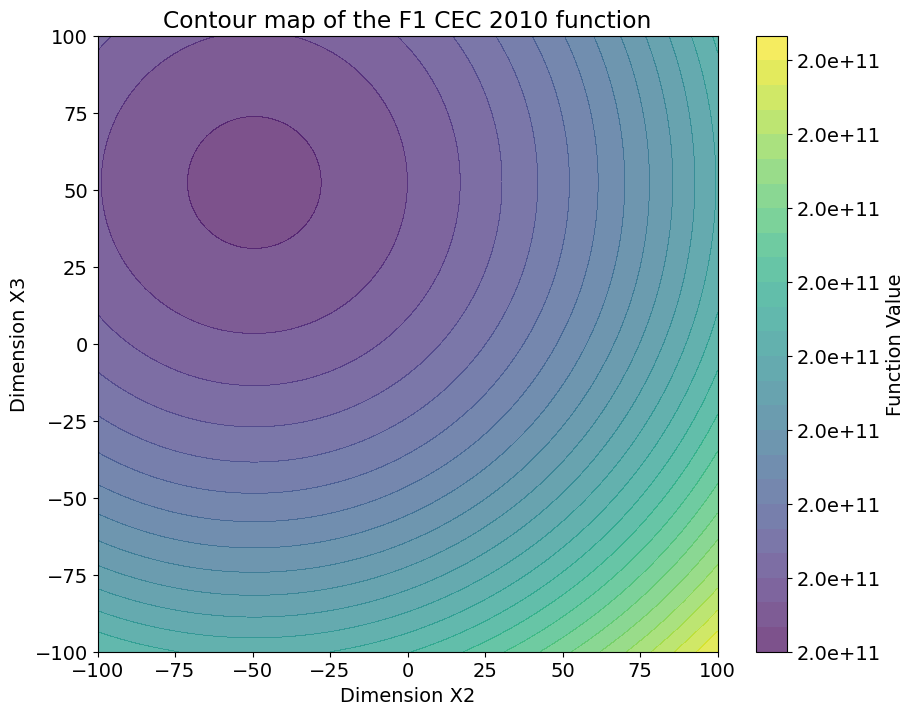
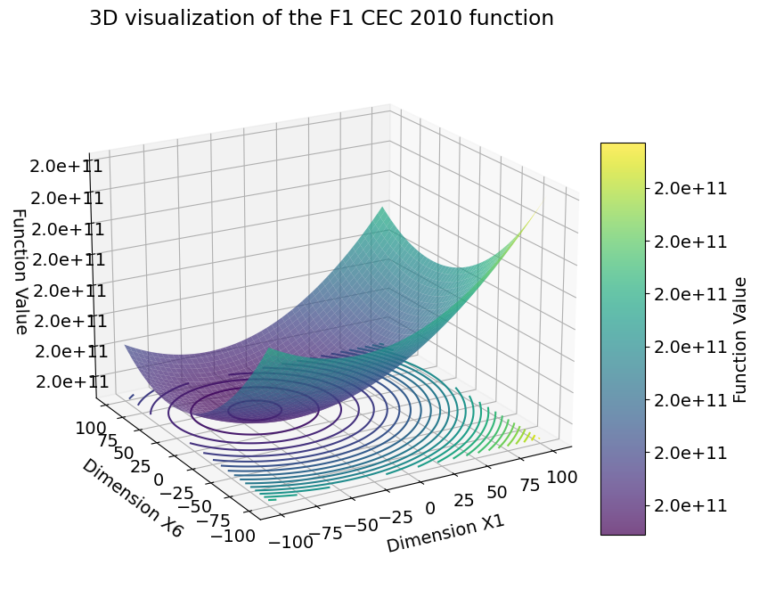

<p align="center"></p>

---


[](https://github.com/thieu1995/opfunu/releases)
[](https://pypi.python.org/pypi/opfunu) 
[](https://badge.fury.io/py/opfunu)


[](https://pepy.tech/project/opfunu)
[](https://github.com/thieu1995/opfunu/actions/workflows/publish-package.yaml)

[](https://opfunu.readthedocs.io/en/latest/?badge=latest)
[](https://t.me/+fRVCJGuGJg1mNDg1)
[](http://isitmaintained.com/project/thieu1995/opfunu "Average time to resolve an issue")
[](http://isitmaintained.com/project/thieu1995/opfunu "Percentage of issues still open")

[](https://git-scm.com/book/en/v2/GitHub-Contributing-to-a-Project)
[](https://doi.org/10.5281/zenodo.3620960)
[](https://www.gnu.org/licenses/gpl-3.0)


OPFUNU (OPtimization benchmark FUnctions in NUmpy) is the largest python library for cutting-edge numerical 
optimization benchmark functions. Contains all CEC competition functions from 2005, 2008, 2010, 2013, 2014, 2015, 
2017, 2019, 2020, 2021, 2022. Besides, more than 300 traditional functions with different dimensions are implemented.

* **Free software:** GNU General Public License (GPL) V3 license
* **Total problems**: > 500 problems
* **Documentation:** https://opfunu.readthedocs.io
* **Python versions:** >= 3.7.x
* **Dependencies:** numpy, matplotlib


# Citation Request 

Please include these citations if you plan to use this library:

- LaTeX:

```bibtex
  @article{Van_Thieu_2024_Opfunu,
      author = {Van Thieu, Nguyen},
      title = {Opfunu: An Open-source Python Library for Optimization Benchmark Functions},
      doi = {10.5334/jors.508},
      journal = {Journal of Open Research Software},
      month = {May},
      year = {2024}
  }
```

- APA:
  
  Van Thieu, N. (2024). Opfunu: An Open-source Python Library for Optimization Benchmark Functions. <i>Journal of Open Research Software</i>, <i>12</i>(1), 8. https://doi.org/10.5334/jors.508


# Installation and Usage

### Install with pip

Install the [current PyPI release](https://pypi.python.org/pypi/opfunu):
```sh
$ pip install opfunu
```

After installation, you can import and check version of Opfunu:

```sh
$ python
>>> import opfunu
>>> opfunu.__version__

>>> dir(opfunu)
>>> help(opfunu)

>>> opfunu.FUNC_DATABASE      # List all name_based functions
>>> opfunu.CEC_DATABASE       # List all cec_based functions
>>> opfunu.ALL_DATABASE       # List all functions in this library

>>> opfunu.get_functions_by_classname("MiShra04")
>>> opfunu.get_functions_based_classname("2015")
>>> opfunu.get_functions_by_ndim(2)
>>> opfunu.get_functions_based_ndim(50)

>>> opfunu.get_name_based_functions(ndim=10, continuous=True)
>>> opfunu.get_cec_based_functions(ndim=2)
```

Let's go through some examples.


### Examples

How to get the function and use it

#### 1st way

```python
from opfunu.cec_based.cec2014 import F12014

func = F12014(ndim=30)
func.evaluate(func.create_solution())

## or

from opfunu.cec_based import F102014

func = F102014(ndim=50)
func.evaluate(func.create_solution())
```


#### 2nd way

```python
import opfunu

funcs = opfunu.get_functions_by_classname("F12014")
func = funcs[0](ndim=10)
func.evaluate(func.create_solution())

## or

all_funcs_2014 = opfunu.get_functions_based_classname("2014")
print(all_funcs_2014)
```


### How to draw 2D, 3D 

Two ways if you want to draw functions that available in Opfunu.

```python
from opfunu.cec_based import F12010
f0 = F12010()

# Visualize opfunu function using method in object
f0.plot_2d(selected_dims=(2, 3), n_points=300, ct_cmap="viridis", ct_levels=30, ct_alpha=0.7,
           fixed_strategy="mean", fixed_values=None, title="Contour map of the F1 CEC 2010 function",
           x_label=None, y_label=None, figsize=(10, 8), filename="2d-f12010", exts=(".png", ".pdf"), verbose=True)

f0.plot_3d(selected_dims=(1, 6), n_points=500, ct_cmap="viridis", ct_levels=30, ct_alpha=0.7,
           fixed_strategy="mean", fixed_values=None, title="3D visualization of the F1 CEC 2010 function",
           x_label=None, y_label=None, figsize=(10, 8), filename="3d-f12010", exts=(".png", ".pdf"), verbose=True)

## Visualize opfunu function using utility function
from opfunu import draw_2d, draw_3d

draw_2d(f0.evaluate, f0.lb, f0.ub, selected_dims=(2, 3), n_points=300)
draw_3d(f0.evaluate, f0.lb, f0.ub, selected_dims=(2, 3), n_points=300)
```

<table>
  <tr>
    <td style="text-align: center;">
      
      <p style="text-align: center;">F1-2010 CEC 2D</p>
    </td>
    <td style="text-align: center;">
      
    <p style="text-align: center;">F1-2010 CEC 3D</p>
    </td>
  </tr>
</table>


### How to draw Latex

Two ways if you want to draw latex equation. 

```python
from opfunu.cec_based import F12010
from opfunu.name_based import Ackley02
from opfunu.utils.visualize import draw_latex

f0 = F12010()
f1 = Ackley02()

## Plot using function inside the object
f0.plot_latex(f0.latex_formula, figsize=(8, 3), dpi=500, title="Latex equation", exts=(".png", ".pdf"), verbose=True)
f1.plot_latex(f1.latex_formula_global_optimum, figsize=(8, 3), dpi=500, title="Global optimum", verbose=True)

## Plot using module
draw_latex(f0.latex_formula_bounds, title="Boundary for Function")
draw_latex(f1.latex_formula_dimension, title=None)
```


For more usage examples please look at [examples](/examples) folder.


# Contributing

There are lots of ways how you can contribute to Permetrics's development, and you are welcome to join in! For example, 
you can report problems or make feature requests on the [issues](/issues) pages. To facilitate contributions, 
please check for the guidelines in the [CONTRIBUTING.md](/CONTRIBUTING.md) file.


# Official channels 

* [Official source code repository](https://github.com/thieu1995/opfunu)
* [Official document](https://opfunu.readthedocs.io/)
* [Download releases](https://pypi.org/project/opfunu/) 
* [Issue tracker](https://github.com/thieu1995/opfunu/issues) 
* [Notable changes log](/ChangeLog.md)
* [Official discussion group](https://t.me/+fRVCJGuGJg1mNDg1)


---

Developed by: [Thieu](mailto:nguyenthieu2102@gmail.com?Subject=Opfunu_QUESTIONS) @ 2023
